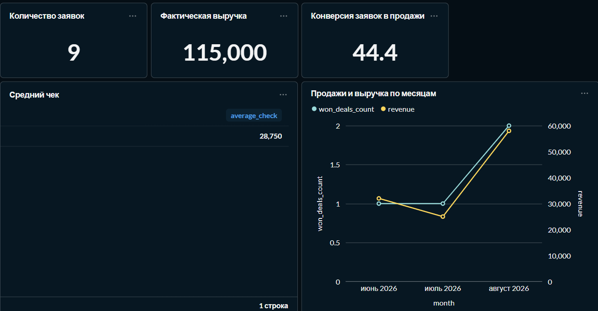
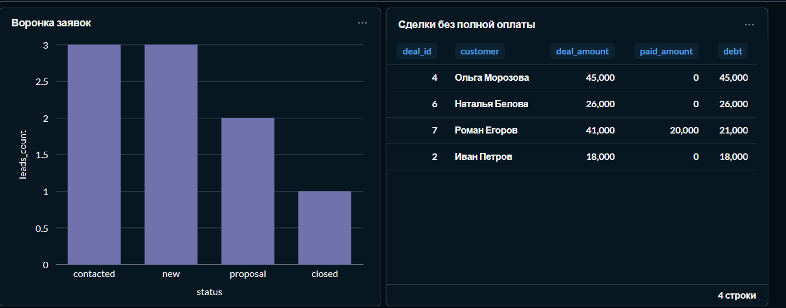
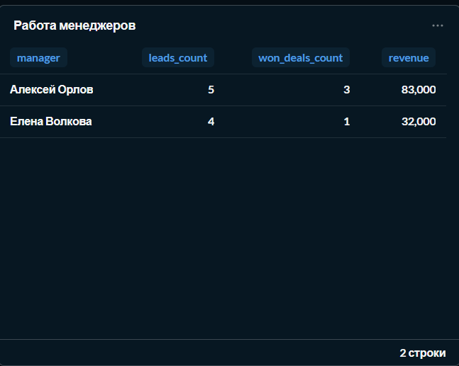
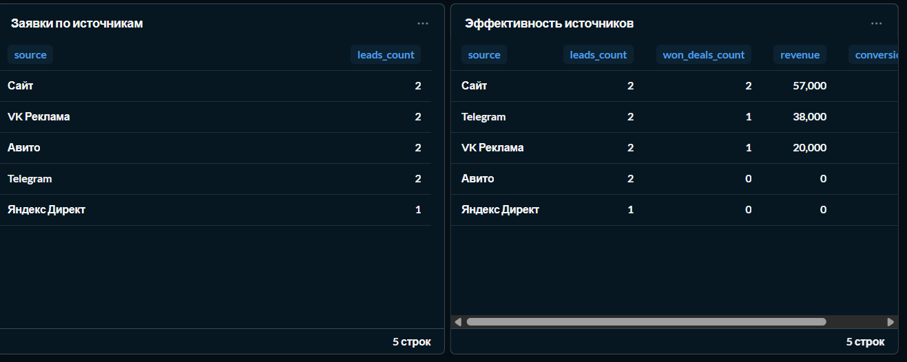
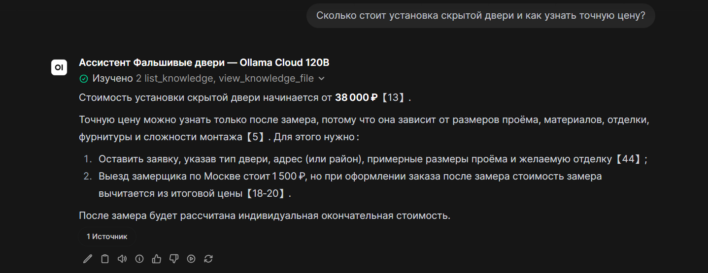
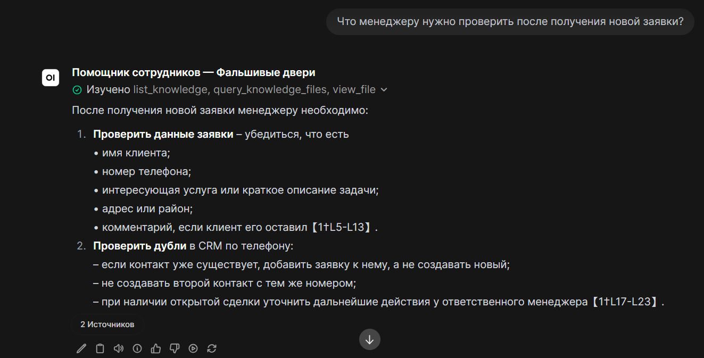
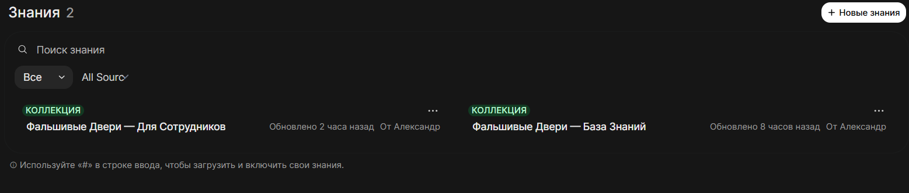

# Small Business Demo — «Фальшивые двери»

Учебный демонстрационный стенд для небольшой компании, устанавливающей фальшивые и скрытые двери в Москве и Московской области.

## Цель проекта

Построить связку для малого бизнеса:

```text
Документы → AI FAQ
Данные продаж → PostgreSQL → Metabase
Сайт → FastAPI → CRM → уведомления
```

Аналитика и AI FAQ уже реализованы. Следующий модуль — форма заявок, FastAPI, Telegram и Twenty CRM.

## Готово: аналитика продаж

Модуль [`analytics/`](analytics/) уже позволяет:

- запустить PostgreSQL и Metabase в Docker;
- загрузить клиентов из CSV или Excel через Python;
- загрузить заявки, сделки и оплаты из CSV;
- проверить структуру и качество входных данных;
- предотвратить дубли при повторном запуске;
- построить дашборды в Metabase;
- сделать backup PostgreSQL.

### Архитектура

```text
CSV / XLSX
    ↓
Python ETL
    ↓
PostgreSQL (Docker)
    ↓
Metabase (Docker)
    ↓
Дашборды и отчёты
```

### Стек

- Docker Compose
- PostgreSQL 16
- Python 3.12
- pandas, openpyxl, psycopg
- DBeaver
- Metabase
- Git и GitHub

### Основные показатели

- количество заявок;
- фактическая выручка;
- средний чек;
- конверсия заявок в продажи;
- воронка заявок;
- работа менеджеров;
- эффективность рекламных источников;
- сделки без полной оплаты.

## Дашборды

### Панель владельца



### Воронка продаж



### Работа менеджеров



### Источники клиентов



## Быстрый запуск аналитики

```cmd
cd analytics
docker compose up -d
```

После запуска:

- Metabase: <http://localhost:3000>
- PostgreSQL для DBeaver: `localhost:5432`

Подробная инструкция: [`analytics/README.md`](analytics/README.md).

## Обновление данных

```cmd
cd analytics
.venv\Scripts\activate
python etl\run_all.py
```

## Готово: AI FAQ

Модуль [`ai-faq/`](ai-faq/) включает:

- Open WebUI в Docker;
- клиентскую базу знаний;
- отдельную внутреннюю базу сотрудников;
- локальные и облачные модели через Ollama;
- строгий RAG Template;
- многоязычные embeddings и гибридный поиск;
- 50 клиентских тестов;
- переиспользуемый API-автотестер;
- backup Open WebUI с проверкой восстановления.

### Архитектура AI FAQ

```text
Markdown-документы
    ↓
retrieval / embeddings
    ↓
LLM через Ollama Cloud
    ↓
ответ по базе знаний
```

### Клиентский ассистент



### Внутренний помощник сотрудников



### Раздельные базы знаний



Подробная инструкция: [`ai-faq/README.md`](ai-faq/README.md).

## Структура проекта

```text
small-business-demo/
├── analytics/       # PostgreSQL, Metabase и ETL
├── ai-faq/          # Open WebUI, базы знаний и автотесты
├── crm-leads/       # будущие сайт, FastAPI и CRM
├── shared/          # общие компоненты
└── docs/            # документация проекта
```

## План развития

- [x] Аналитика продаж: PostgreSQL, Metabase, CSV/XLSX ETL
- [x] AI FAQ: клиентская/внутренняя базы, RAG и 50 тестов
- [ ] CRM и заявки: сайт, FastAPI, Telegram, Twenty CRM

## Демо-данные и безопасность

Репозиторий содержит только вымышленные демонстрационные данные. Локальные пароли, `.env`, логи и backup-файлы исключены из Git.
